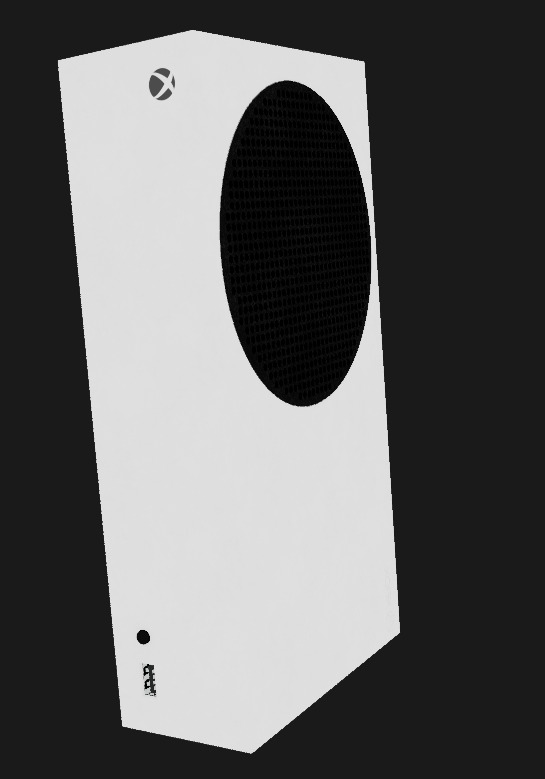

 HeliosEngine

Compendio de Gráficas Computacionales 3D | Generación 2026-1

<i>Renderizado en tiempo real de modelo de alta fidelidad con iluminación y texturizado básico.</i>

📖 Acerca del Proyecto

HeliosEngine es un motor de renderizado 3D en tiempo real construido desde cero (from scratch) utilizando C++ y la API nativa de DirectX 11.

Este proyecto no utiliza motores comerciales (como Unity o Unreal); su propósito es desmitificar la "caja negra" del renderizado gráfico. Sirve como una implementación práctica y académica de los conceptos fundamentales del pipeline gráfico, abarcando:

Inicialización de bajo nivel: Win32 API y Contextos de Dispositivo.

Matemáticas 3D: Matrices de Mundo, Vista y Proyección.

Gestión de Memoria: Buffers de Vértices e Índices en VRAM.

Shading Programable: HLSL (Vertex & Pixel Shaders).

✨ Características Principales

🛠️ Core & Pipeline

Pipeline DirectX 11 Completo: Implementación robusta de Device, DeviceContext, SwapChain, RenderTargetView y DepthStencilView.

Anti-Aliasing (MSAA): Configuración automática de calidad de muestreo (4x MSAA) adaptativa a la GPU para bordes suaves.

Game Loop Personalizado: Bucle de mensajes Win32 optimizado con cálculo de DeltaTime de alta precisión.

🎨 Gráficos & Renderizado

Parser Manual de .obj: Cargador de modelos personalizado escrito sin librerías externas para geometría.

Lectura optimizada de posiciones (v), coordenadas de textura (vt) y normales (vn).

Triangulación de geometría compleja.

Soporte de Texturas: Carga nativa de texturas (.png, .jpg, .dds) aplicadas al modelo mediante Shader Resource Views.

Shaders HLSL:

Vertex Shader (VS): Transformación de espacio local a espacio de pantalla.

Pixel Shader (PS): Muestreo de texturas y colorizado básico.

🕹️ Interactividad & UI

Cámara Dinámica: Sistema de cámara con control de Zoom interactivo.

Interfaz de Usuario (ImGui): Integración completa de Dear ImGui para depuración en tiempo real:

Control de Transformaciones (Posición, Rotación, Escala).

Control de Zoom de cámara.

Botones de Reset [R] para restablecer valores por defecto rápidamente.

📂 Arquitectura del Proyecto

Una visión general de las clases más importantes del motor:

Clase

Responsabilidad

BaseApp

El Director. Orquesta la aplicación, maneja la ventana Win32, inicializa el hardware y ejecuta el bucle principal.

Device

La GPU Virtual. Encapsula la creación de recursos de hardware (Buffers, Texturas, Shaders).

DeviceContext

El Artista. Envía comandos de renderizado a la GPU (Draw calls, cambios de estado).

SwapChain

El Presentador. Gestiona el doble búfer (Double Buffering) para mostrar imágenes sin parpadeos (tearing).

ModelLoader

El Traductor. Lee archivos de texto .obj crudos y los convierte en estructuras de vértices C++.

Actor

La Entidad. Representa un objeto en el mundo, uniendo su Malla, su Transformación y sus Texturas.

ShaderProgram

El Programa. Compila y gestiona los shaders HLSL que procesan la geometría y los píxeles.

⚙️ Cómo Compilar y Ejecutar

Prerrequisitos

Visual Studio 2022

Carga de trabajo: "Desarrollo de escritorio con C++"

Windows 10/11 SDK

Pasos de Instalación

Clonar el repositorio:

git clone [https://github.com/CsZBactery/HeliosEngine.git](https://github.com/CsZBactery/HeliosEngine.git)

Abrir el proyecto:
Ejecuta HeliosEngine.sln con Visual Studio 2022.

Configuración de Assets (Crucial):
El ejecutable busca la carpeta Assets en el directorio de trabajo.

Asegúrate de que la carpeta Assets esté en la raíz del proyecto (junto a los archivos .cpp).

O configura en VS: Propiedades > Depuración > Directorio de trabajo = $(ProjectDir).

Compilar y Ejecutar:

Configuración: Debug.

Plataforma: x64.

Presiona F5 para compilar y lanzar el motor.

🎮 Controles

Input

Acción

Interfaz (Ventana)

Usa el mouse para arrastrar los sliders de posición, rotación o escala.

Botón [R]

Restablece el valor asociado (Posición a 0, Escala a 1, etc.).

Slider Zoom

Acerca o aleja la cámara del objeto.

Desarrollado por <b>[CsZBactery]</b> - Gráficas Computacionales 3D

